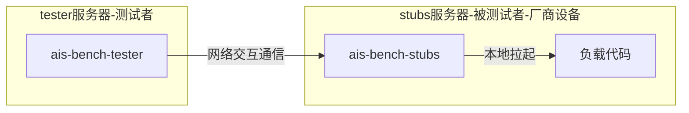
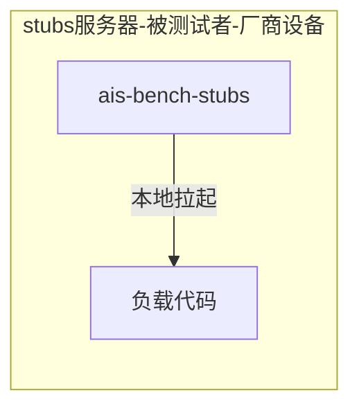

# ais-bench-workload

## 介绍  

[Tools](https://gitee.com/ascend/tools.git)仓ais-bench-workload目录主要承载基于AISBench测试基准的模型负载代码以及为AISBench测试基准贡献的高易用性子工具，用于AI服务器的性能测试。

### AISBench场景介绍

AISBench标准化性能测试软件，又称AI Server Benchmark软件，是根据AI标准（IEEE 2937及 T/CESA 1169-2021）对AI服务器进行性能测试的工具软件。

AISBench软件包括如下2个测试场景：

- 网络测试模式 - 适用于正式测试场景

- 本地离线测试模式 - 适用于本地裸机测试场景，不需要联网,不需要连接tester服务器

### AISBench工具介绍

AISBench包括如下工具：

| 工具名               | 工具及资料获取                                               |
| -------------------- | ------------------------------------------------------------ |
| AISBench测试基准工具 | 请从[人工智能系统性能基准工作组](https://www.aisbench.com/tool)获取。 |
| AISBench模型负载工具 | 训练负载：https://gitee.com/aisbench/training 推理负载：https://gitee.com/aisbench/inference 历史版本：https://gitee.com/ascend/tools/tree/master/ais-bench_workload/src |
| AISBench推理工具     | https://gitee.com/ascend/tools/tree/master/ais-bench_workload/tool/ais_bench |

## 贡献

欢迎参与贡献。更多详情，请参阅我们的[贡献者Wiki](../CONTRIBUTING.md)。

## 许可证
[Apache License 2.0](LICENSE)

