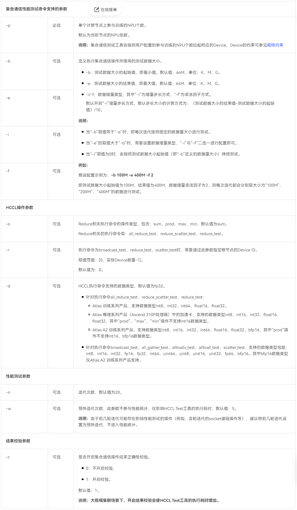

# AISBench 通信测评工具
## 名称定义
|名词|定义|
| ---- | ---- |
|操作节点|启动本工具的节点，也是集群中root rank所在的节点（master 节点）|
## 简介
本文介绍AISBench通信测评工具，此工具可快速部署在服务器单机或集群上，用于测试集合通信的功能正确性以及性能，当前对接了HCCL（Huawei Collective Communication Library）。在未来本工具会提供更多快速定位集合通信的功能。

## 工具安装&前置准备
### 环境和依赖
- 请参见《CANN开发工具指南》安装昇腾设备开发或运行环境，即CANN toolkit软件包(请确保集群中所有节点安装的CANN包版本一致)。
- 安装Python3(3.7及以上版本)、Python包模块paramiko、scp、wheel(启动本工具的操作节点上必须安装)。

### 配置当前操作节点到集群通信节点的SSH信任关系，以支持集群通信节点远程登录
1. 在当前操作节点生成密钥信息（如若环境中存在，可不重复执行）：

   ```bash
   ssh-keygen -t rsa -b 2048
   ```

   例如密钥信息生成后，私钥默认存储在`~/.ssh/id_rsa`文件中，公钥默认存储在`~/.ssh/id_rsa.pub`文件中。

2. 将操作节点公钥复制到集群通信节点（包含操作节点），实现SSH密钥登录远程主机。

   ```
   ssh-copy-id -i ~/.ssh/id_rsa.pub <user0>@<node0 ip>
   ssh-copy-id -i ~/.ssh/id_rsa.pub <user1>@<node1 ip>
   ......
   ```

3. 在操作节点使用SSH远程登录`<user>@<node ip>`，确认可以直接免密登录。

   **注意**：当前工具使用SSH只支持ipv4。

### 工具安装与卸载
#### 获取whl包
从[工具发布界面](RELEASE_INFO.md)获取工具安装包`ais_bench_net_test-<version>-py3-none-linux_<arch>.whl`

其中`<version>`为工具版本，`<arch>`表示cpu架构。
#### 安装whl包
方式1：手动在所有节点安装

1. 出于安全考虑，安装前在所有集群通信节点设置umask值：

   ```bash
   umask 0022
   ```

2. 在所有集群通信节点的python3环境上执行如下命令进行安装：
   ```bash
   pip3 install ./ais_bench_net_test-<version>-py3-none-linux_<arch>.whl
   ```
   说明：若为覆盖安装，请增加“--force-reinstall”参数强制安装，例如：
   ```bash
   pip3 install ./ais_bench_net_test-<version>-py3-none-linux_<arch>.whl --force-reinstall
   ```

方式2：在操作节点安装，通过操作节点部署到到其他集群通信节点

1. 出于安全考虑，安装前在操作节点设置umask值：

   ```bash
   umask 0022
   ```

2. 在操作节点的python3环境上执行如下命令进行安装：
   ```bash
   pip3 install ./ais_bench_net_test-<version>-py3-none-linux_<arch>.whl
   ```

3. 在操作节点上执行如下命令，为其他集群通信节点安装本工具：
   ```bash
   python3 -m ais_bench install -f <hostfile>
   ```
   其中hostfile内容的配置参考 章节"备注说明 > [--hostfile传入文件的格式](#jump1)"。


#### 卸载whl包
在每个安装了本工具的集群环境中，执行如下命令卸载本工具：
```bash
pip3 uninstall ais_bench_net_test
```

## 使用方法
### 快速上手
假设有一个双机集群，集群每个节点都有8张device可以使用，节点的os ip分别为10.1.1.0 和 10.1.1.1，将10.1.1.0这个节点作为操作节点。
#### 准备好hostfile
hostfile的内容如下：
```bash
10.1.1.0:8
10.1.1.1:8
```
#### 启动工具进行集合通信测试
执行如下命令：
```bash
python3 -m ais_bench -f hostfile -n 16 all_reduce_test -p 8 -b 8K -e 64M -f 2 -d fp32 -o sum
```
该命令的含义是在双机共16卡上执行测试数据大小起始值为8KB，结束值为64MB，数据增量乘法因子为2的all_reduce_test集合通信测试任务。

### 命令行参数说明
整体命令格式：
```bash
python3 -m ais_bench <sub module> <other cmds>
```
执行`python3 -m ais_bench -h`查看帮助：
```bash
usage: __main__.py [-h] {run,install} ...

ais_bench net_test tool

positional arguments:
  {run,install}  ais_bench net_test sub module, default "run"
    run          run net test
    install      install whl pkg for other nodes

optional arguments:
  -h, --help     show this help message and exit

```

目前本工具有如下二级命令
|二级命令|含义|备注|
| ---- | ---- | ---- |
|run|运行集合通信任务|默认的二级命令|
|install|安装功能|为集群中操作节点以外的其他节点一键安装软件包|

#### run二级命令
整体命令格式：
```bash
# 默认不带run二级命令
python3 -m ais_bench [optional arguments] <op task> [op cmds]
# 显示带run二级命令
python3 -m ais_bench run [optional arguments] <op task> [op cmds]
```

##### 常规命令（optional arguments）
|参数名|简写|说明|是否必选|
| ---- | ---- | ----- | ----- |
|--hostfile|-f|操作节点上的节点列表文件。权限不得超过0o600。格式参考章节["备注说明> --hostfile传入文件的格式"](#jump1)。若不配置此文件，默认使用操作节点单机运行(这种情况下不需要配置--ssh_key_path)|是|
|--rank_size|-n|集群中参与集合通信测评的总device数量，默认值：8|否|
|--link_port|-lpt|共享root rank信息的端口，默认21345|否|
|--ssh_key_path|-skp|操作节点ssh私钥的路径，权限不得超过0o600，默认/root/.ssh/id_rsa| 否|
|--python|-py|每个节点使用的python解释器，可选["python3", "python", "python3.7", "python3.8", "python3.9", "python3.10", "python3.11"]，默认 python3|否|
|--env_script_path|-esp|每个节点上配置环境变量的shell脚本路径，权限不得超过0o755，在执行命令前此脚本会先在每个节点上被source，默认 /usr/local/Ascend/ascend-toolkit/set_env.sh|否|
|--run_mode|-rm|运行模式，目前可选["full"]，默认 "full",所有device统一拉起一次|否|
|--help|-h|显示帮助信息|

##### 通信算子任务选择（op task）
本参数必填
|可选op task|
| ---- |
|all_gather_test|
|all_reduce_test|
|alltoallv_test|
|alltoall_test|
|broadcast_test|
|reduce_scatter_test|
|reduce_test|
|scatter_test|

##### 后端相关命令（op cmds）
这部分命令与hccl_test中通信算子可执行文件传入的相关命令一致，参考昇腾社区CANN文档中“HCCL性能测试工具 > 参数说明 > [HCCL Test工具相关参数](https://www.hiascend.com/document/detail/zh/canncommercial/80RC3/devaids/devtools/hccltool/HCCLpertest_16_0005.html#ZH-CN_TOPIC_0000002082057253__section18761173413116)”：<br>



#### install二级命令
**整体命令格式：**

```bash
python3 -m ais_bench install [optional arguments]
```

##### 常规命令（optional arguments）
|参数名|简写|说明|是否必选|
| ---- | ---- | ----- | ----- |
|--hostfile|-f|操作节点上的节点列表文件。权限不得超过0o600。格式参考章节"备注说明 > [--hostfile传入文件的格式](#jump1)"。若不配置此文件，不会有任何安装行为|是|
|--ssh_key_path|-skp|操作节点ssh私钥的路径，权限不得超过0o600，默认/root/.ssh/id_rsa| 否|
|--env_script_path|-esp|每个节点(除操作节点)上配置环境变量的shell脚本路径，权限不得超过0o755，在执行命令前此脚本会先在每个节点上被source，默认 /usr/local/Ascend/ascend-toolkit/set_env.sh|否|
|--pip|NA|每个节点(除操作节点)使用的pip解释器，可选["pip3", "pip"]，默认 "pip3"|否|
|--whl_pkg_path|-wp|操作节点上whl包的路径，权限不得超过0o755，默认识别 `./ais_bench_net_test-<version>-py3-none-linux_<arch>.whl`用于安装。<br> 其中`<version>`为操作节点上当前运行的本工具的版本|否|
|--force-reinstall|-fr|为其他节点安装whl包时执行强制安装，该操作不会重装whl包的依赖包|否|
|--help|-h|显示帮助信息||

### 运行结果说明
参考昇腾社区CANN文档中“HCCL性能测试工具 > [结果说明](https://www.hiascend.com/document/detail/zh/canncommercial/80RC3/devaids/devtools/hccltool/HCCLpertest_16_0006.html)”章节。

### 规格约束说明
参考昇腾社区CANN文档中“HCCL性能测试工具 > [规格约束](https://www.hiascend.com/document/detail/zh/canncommercial/80RC3/devaids/devtools/hccltool/HCCLpertest_16_0007.html)”章节

## 备注说明
### --hostfile传入文件的格式 <a name="jump1"></a>
合法文件内容样例：
```bash
# 训练节点IP(ipv4):每节点最大device数:节点用户（默认root）:连接节点的端口（默认22）
10.10.10.10:8
10.10.10.11:3:user1
10.10.10.12:3:user1:22
```
<b> 注意：--hostfile传入文件内容中训练节点ip不可重复 </b>

### 运行时集群规模相关参数的约束关系

以下约束仅与“run二级命令”相关。

#### 配置了--hostfile时
1. --rank_size参数取值需要是-p取值的整数倍。
2. --hostfile传入文件内容中只有前N行节点信息会生效，其中N=(--rank_size参数取值/-p取值)。
3. 需要确保--hostfile传入文件内容中生效的节点的最大device数大于等于-p的取值。
#### 未配置--hostfile时
1. --rank_size参数取值必须和-p取值相等。
2. --rank_size参数取值不能超过操作节点实际最大device数。