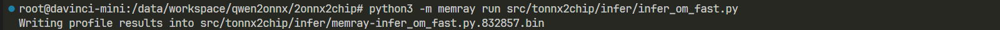
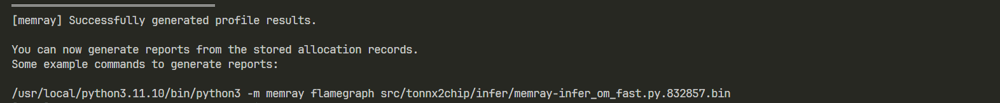
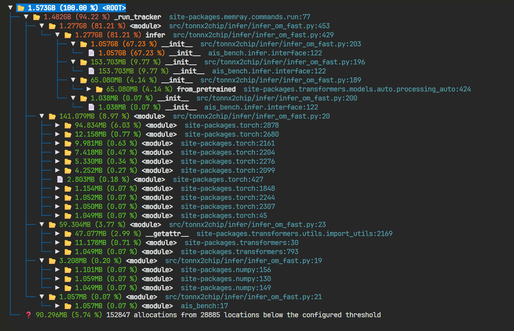
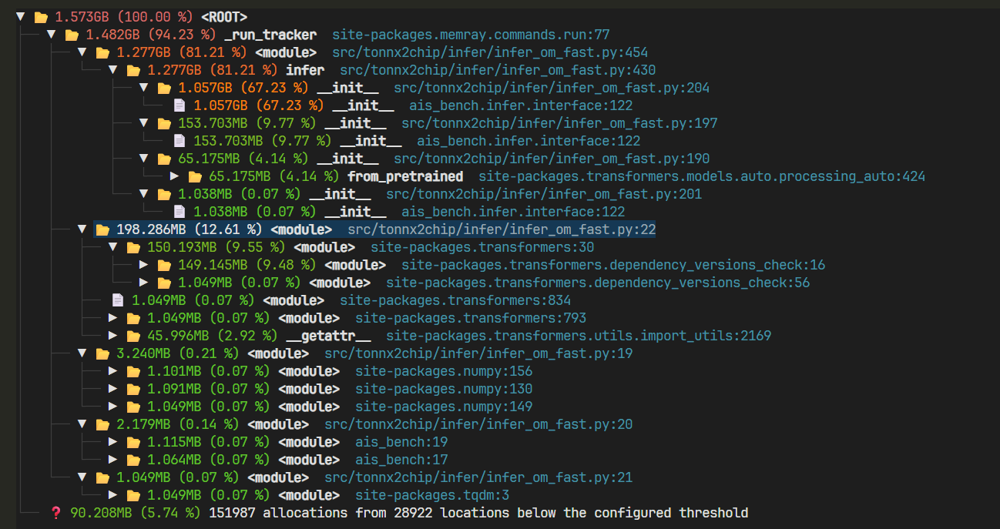

```bash
python3 -m pip install memray

memray run  --native src/tonnx2chip/infer/infer_om_fast.py
# Writing profile results into src/tonnx2chip/infer/memray-infer_om_fast.py.832857.bin
# 以上命令会输出一个二进制文件，随后我们可以根据需要生成统计报告。
memray summary src/tonnx2chip/infer/memray-infer_om_fast.py.832857.bin

pip install tree-sitter==0.26.0 tree-sitter-python==0.25.0
memray tree src/tonnx2chip/infer/memray-infer_om_fast.py.1067834.bin

# 动态监控
memray run --live src/tonnx2chip/infer/infer_om_fast.py
```





```bash
memray flamegraph src/tonnx2chip/infer/memray-infer_om_fast.py.832857.bin
```


| 内存 | api |
| --- | --- |
| 1.057GB | 初始化prefill实例 |
|153.703MB | 初始化vit实例 |
|65.080MB | 初始化processor实例 |
|1.038MB | 初始化embed实例 |
| 141.079MB | import torch |
| 59.304MB| from transformers import AutoProcessor （用于tokenizer） |
| 3MB| import numpy |
| 90.296MB | ?? |




去掉torch,那么transformers库就会再导入一遍，所以内存没变化



```bash
memray run  --native test/test_om.py

memray tree  test/memray-test_om.py.1107133.bin
```
